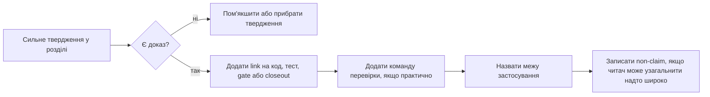

# Додаток Б: Матриця тверджень і доказів

Цей додаток потрібен не для краси. Він знімає головний ризик технічної роботи для експертного захисту: сильні твердження мають бути швидко перевірними. Якщо твердження (claim) не веде до коду, gate віхи (milestone gate) або команди відтворення, воно має бути або пом'якшене, або прибране.

## Як читати матрицю

* **Твердження (Claim)** — твердження, яке книга дозволяє собі зробити.
* **Код (Code)** — контракт або реалізація, яка несе поведінку.
* **Тести (Tests)** — сфокусовані тести, які перевіряють поведінкову межу.
* **Вимірювання / артефакт (Measurement / Artifact)** — gate віхи, closeout або команда, яка дає доказ продуктивності чи релізу.
* **Межа (Scope)** — межа, за яку твердження не виходить.

## Маршрут аудиту (Audit Route)

Цей маршрут важливий для стилю книги. Ми не прибираємо амбіцію; ми змушуємо кожне сильне речення пройти через доказ, команду або явно названу межу.

## Індекс твердження -> код -> тест -> вимірювання (Claim -> Code -> Test -> Measurement Index)

| Твердження (Claim) | Код (Code) | Тести (Tests) | Вимірювання / артефакт (Measurement / Artifact) | Межа (Scope) |
| :--- | :--- | :--- | :--- | :--- |
| [`RadarStreamEvent`](../../../src/Domain/Streaming/Streams/Models/RadarStreamEvent.cs) є компактним контрактом гарячого шляху (compact hot-path contract) | [RadarStreamEvent.cs](../../../src/Domain/Streaming/Streams/Models/RadarStreamEvent.cs), [RadarEventBatchBuilder.cs](../../../src/Domain/Streaming/Batches/Services/RadarEventBatchBuilder/RadarEventBatchBuilder.cs) | [RadarStreamContractTests.cs](../../../tests/RadarPulse.Tests/Streaming/Streams/RadarStreamContractTests.cs), [RadarEventBatchBuilderTests](../../../tests/RadarPulse.Tests/Streaming/Batches/RadarEventBatchBuilderTests) | [004 closeout](../../milestones/004-processing-core-input-contract-closeout.md), [Розділ 3](chapter_03_radar_batch.md) | Гарячий шлях архіву/повторення (archive/replay), не довільне live-приймання |
| Потоковий бенчмарк (stream benchmark) досяг 500M+ payload-значень/с (payload values/s) | [RadarEventBatchBuilder.cs](../../../src/Domain/Streaming/Batches/Services/RadarEventBatchBuilder/RadarEventBatchBuilder.cs) | [RadarStreamContractTests.cs](../../../tests/RadarPulse.Tests/Streaming/Streams/RadarStreamContractTests.cs) | `553_123_110.90` single-file, `509_716_417.97` cache-wide in [004 closeout](../../milestones/004-processing-core-input-contract-closeout.md) | Прив'язано до заліза й корпусу даних; це не cross-machine certification |
| Парсинг із маніфестом (Manifest-first parsing) уникає сліпої декомпресії | Огляд блоків архіву та код робочої області BZip2 | [Archive tests](../../../tests/RadarPulse.Tests/Archive) | [Розділ 2](chapter_02_nexrad_binaries.md), milestone `001`/`002` closeouts | Шлях інспекції файлів/корпусу, не твердження про live stream |
| Архітектурні межі є виконуваними перевірками (executable boundaries) | Структура проектів Domain/Application/Infrastructure/Presentation | [RadarPulseArchitectureTests.cs](../../../tests/RadarPulse.Tests/Architecture/RadarPulseArchitectureTests.cs) | [Розділ 5](chapter_05_architecture_guards.md), [036 closeout](../../milestones/036-clean-architecture-hardening-closeout.md) | Guards перевіряють заявлені межі, але не замінюють design review |
| Копіювання зліпка (`snapshot-copy`) спричинило кризу утриманих алокацій | [RadarProcessingRetainedPayloadFactory.SnapshotCopy.cs](../../../src/Infrastructure/Processing/Retention/Services/RadarProcessingRetainedPayloadFactory/RadarProcessingRetainedPayloadFactory.SnapshotCopy.cs) | [Retention factory tests](../../../tests/RadarPulse.Tests/Processing/Retention/RadarProcessingRetainedPayloadFactoryTests) | `9_947_507_832` retained bytes in [010 gate](../../milestones/010-owned-provider-overlap-cost-reduction-performance-gate.md) | Контур owned payload |
| Копіювання через пул (`pooled-copy`) зменшило утриману алокацію приблизно на `98.97%` | [RadarProcessingRetainedPayloadFactory.PooledCopy.cs](../../../src/Infrastructure/Processing/Retention/Services/RadarProcessingRetainedPayloadFactory/RadarProcessingRetainedPayloadFactory.PooledCopy.cs) | [PooledCopyRetention tests](../../../tests/RadarPulse.Tests/Processing/Retention/RadarProcessingRetainedPayloadFactoryTests) | `9_947_507_832` -> `102_811_264` bytes in [010 gate](../../milestones/010-owned-provider-overlap-cost-reduction-performance-gate.md) | Не нульова алокація всього процесу; тільки retained payload claim |
| Холодний старт (cold start) є окремою вимірюваною вартістю | [RadarProcessingRetainedPayloadFactory.Prewarm.cs](../../../src/Infrastructure/Processing/Retention/Services/RadarProcessingRetainedPayloadFactory/RadarProcessingRetainedPayloadFactory.Prewarm.cs) | [Retention factory tests](../../../tests/RadarPulse.Tests/Processing/Retention/RadarProcessingRetainedPayloadFactoryTests) | natural `138_151_728`, prewarmed `68_420_960`, borrowed `70_635_296`, misses `0` in [017 gate](../../milestones/017-file-level-default-readiness-and-cold-retained-ownership-cost-measurefile-gate.md) | Репрезентативна file probe, не універсальна гарантія |
| Поштові скриньки воркерів і зворотний тиск (worker mailboxes/backpressure) є явними межами рантайму | Queueing session and async worker composition | [RadarProcessingQueuedProcessingSessionTests](../../../tests/RadarPulse.Tests/Processing/Queueing/RadarProcessingQueuedProcessingSessionTests) | [Розділ 10](chapter_10_async_transport.md) | Контракт локального процесу, не broker semantics |
| Криза спільного стану реально зупиняла безпечну роботу активних батчів | [RadarProcessingBatchDelta.cs](../../../src/Domain/Processing/Core/Models/RadarProcessingBatchDelta.cs) | [RadarProcessingBatchDeltaTests.cs](../../../tests/RadarPulse.Tests/Processing/Core/RadarProcessingBatchDeltaTests.cs) | [Milestone 021: криза спільного стану](../../milestones/021-ordered-concurrent-runtime-archive-processing-slice-3-blocker.md) | Попередня модель спільної мутації ядра |
| Обчислення дельт і впорядкована фіксація (ordered commit) прибрали кризу з видимою ціною | [RadarProcessingBatchDelta.cs](../../../src/Domain/Processing/Core/Models/RadarProcessingBatchDelta.cs), ordered runtime session code | [RadarProcessingPersistentDurableProcessingSessionTests.cs](../../../tests/RadarPulse.Tests/Processing/Durable/RadarProcessingPersistentDurableProcessingSessionTests.cs) | `active=4 elapsed 0.994x`, allocation `1.006x` in [021 matrix](../../milestones/021-ordered-concurrent-runtime-archive-processing-ordered-full-cache-performance-matrix.md) | Correctness/bounded tax, не універсальне прискорення |
| Перерахунок застарілої топології (stale topology recompute) зберігає коректність змін топології | Topology manager and ordered recompute path | [Rebalance tests](../../../tests/RadarPulse.Tests/Processing/Rebalance) | `39_292` dispatches for `32_000`, allocation `1.137x`, elapsed `0.891x` in [022 gate](../../milestones/022-ordered-rebalance-topology-commit-processing-bottleneck-performance-matrix.md) | Synthetic processing-bottleneck workload |
| Стійкий конверт (durable envelope) є явним скінченним автоматом (FSM) | [RadarProcessingDurableEnvelopeQueue.cs](../../../src/Infrastructure/Processing/Durable/Services/RadarProcessingDurableEnvelopeQueue/RadarProcessingDurableEnvelopeQueue.cs), [RadarProcessingDurableEnvelopeState.cs](../../../src/Domain/Processing/Durable/Models/RadarProcessingDurableEnvelopeState.cs) | [RadarProcessingDurableEnvelopeQueueTests.cs](../../../tests/RadarPulse.Tests/Processing/Durable/RadarProcessingDurableEnvelopeQueueTests.cs) | [Розділ 18](chapter_18_durable_envelope.md), [023 decision trace](../../milestones/023-durable-cross-process-runtime-readiness-decision-trace.md) | Local At-Least-Once semantics, not distributed exactly-once |
| Файлове стійке сховище підтримує локальний перезапуск і відновлення | [RadarProcessingFileDurableEnvelopeStore.cs](../../../src/Infrastructure/Processing/Durable/Stores/RadarProcessingFileDurableEnvelopeStore.cs) | Durable/persistent processing tests | [026 closeout](../../milestones/026-persistent-durable-adapter-readiness-closeout.md), [Розділ 19](chapter_19_file_store.md) | Temp-file replacement, not WAL/fsync/database durability |
| Зупинка без прихованої неправди (Fail-closed) запобігає мовчазно пошкодженому прогресу | Product pipeline fallback/recovery code | [RadarProcessingProductionPipelineFallbackTests.cs](../../../tests/RadarPulse.Tests/Processing/ProductPipeline/RadarProcessingProductionPipelineFallbackTests.cs), [RadarProcessingProductionPipelineRecoveryTests.cs](../../../tests/RadarPulse.Tests/Processing/ProductPipeline/RadarProcessingProductionPipelineRecoveryTests.cs) | [Розділ 20](chapter_20_fail_closed.md) | Availability yields to correctness |
| Користувацькі обробники (custom handlers) ізольовані контрактом і режимом підключення (posture) | [IRadarSourceProcessingHandler.cs](../../../src/Domain/Processing/Handlers/Contracts/IRadarSourceProcessingHandler.cs), [RadarProcessingMvpRuntimePlan.cs](../../../src/Infrastructure/Processing/Runtime/Models/RadarProcessingMvpRuntimePlan.cs) | [Handler tests](../../../tests/RadarPulse.Tests/Processing/Handlers) | [Розділ 21](chapter_21_custom_handlers.md), [Розділ 22](chapter_22_delta_merge.md) | Snapshot fallback/unsupported block/mergeable fast path only |
| Контракт дельта/злиття обробника (handler delta/merge) має гейти коректності та продуктивності | [RadarProcessingHandlerDeltaMergeCoordinator.cs](../../../src/Domain/Processing/Handlers/Services/RadarProcessingHandlerDeltaMergeCoordinator/RadarProcessingHandlerDeltaMergeCoordinator.cs) | [RadarProcessingHandlerDeltaMergeCoordinatorTests.cs](../../../tests/RadarPulse.Tests/Processing/Handlers/RadarProcessingHandlerDeltaMergeCoordinatorTests.cs), [RadarProcessingHandlerDeltaPerformanceGateTests](../../../tests/RadarPulse.Tests/Processing/Handlers/RadarProcessingHandlerDeltaPerformanceGateTests) | `counter-checksum-heavy active=4` allocation `2.612x` noted in [025 matrix](../../milestones/025-handler-delta-merge-contract-for-fast-custom-analytics-full-cache-performance-matrix.md) | Fast path has visible allocation debt |
| BFF захищає UI від внутрішніх моделей рантайму | [RadarProcessingBffReadModelStore.cs](../../../src/Application/Processing/Services/RadarProcessingBffReadModelStore.cs), [RadarPulseProductHttpEndpoints.cs](../../../src/Presentation/RadarPulse.Http/Product/Endpoints/RadarPulseProductHttpEndpoints.cs) | [RadarProcessingBffReadModelStoreTests.cs](../../../tests/RadarPulse.Tests/Processing/ReadModels/RadarProcessingBffReadModelStoreTests.cs), [RadarPulseProductHttpControlTests.cs](../../../tests/RadarPulse.Tests/Product/Http/RadarPulseProductHttpControlTests.cs) | [Розділ 23](chapter_23_bff_shield.md) | Product/demo API, not public multi-tenant hardening |
| Інтерфейс оператора (Operator UI) є локальною кабіною read-model | [Operator UI source](../../../src/Presentation/OperatorUi/src/app), [product API client](../../../src/Presentation/OperatorUi/src/app/product/product-api.client.ts) | [app.spec.ts](../../../src/Presentation/OperatorUi/src/app/app.spec.ts), [operator-ui.smoke.spec.ts](../../../src/Presentation/OperatorUi/smoke/operator-ui.smoke.spec.ts) | [Розділ 24](chapter_24_operator_ui.md), [031 closeout](../../milestones/031-operator-ui-hardening-and-integrated-local-delivery-closeout.md) | Not live radar canvas, not public security surface |
| Готовність демо (demo readiness) є виконуваним протоколом | [radarpulse-product-demo.ps1](../../../scripts/radarpulse-product-demo.ps1), [radarpulse-product-demo.sh](../../../scripts/radarpulse-product-demo.sh) | Script verify route and product/API gates | [Розділ 25](chapter_25_demo_scripts.md), [product-demo-readiness.md](../../product-demo-readiness.md) | Local deterministic demo packaging, not deployment automation |
| Контракт діагностики/готовності (diagnostic/readiness contract) існує до продукційного логування | [RadarProcessingRunDiagnosticsReadModel.cs](../../../src/Application/Processing/ReadModels/RadarProcessingRunDiagnosticsReadModel.cs), [RadarProcessingProviderQueueTelemetrySummary.cs](../../../src/Domain/Processing/Queueing/Telemetry/RadarProcessingProviderQueueTelemetrySummary.cs), [RadarProcessingProductionPipelineOperatorSummary.Blocking.cs](../../../src/Infrastructure/Processing/ProductPipeline/Models/RadarProcessingProductionPipelineOperatorSummary/RadarProcessingProductionPipelineOperatorSummary.Blocking.cs) | [RadarProcessingRunReadModelTests.cs](../../../tests/RadarPulse.Tests/Processing/ReadModels/RadarProcessingRunReadModelTests.cs), [RadarProcessingProductionPipelineSummaryTests.cs](../../../tests/RadarPulse.Tests/Processing/ProductPipeline/RadarProcessingProductionPipelineSummaryTests.cs), [RadarPulseProductPipelineDtoTests.cs](../../../tests/RadarPulse.Tests/Product/Pipeline/RadarPulseProductPipelineDtoTests.cs) | [Розділ 26](chapter_26_observability_logging.md), [Додаток В](appendix_c_production_hardening.md) | Typed diagnostics/readiness only; not `ILogger`/OpenTelemetry production observability |
| Лабораторний стенд можна підняти без приватних кроків автора на Windows і Linux | [Archive CLI historical loader](../../../src/Presentation/RadarPulse.Cli/EntryPoint/RadarPulseCliApplication/ArchiveCliApplication/ArchiveCliApplication.Historical.cs), [RadarPulseCliUsage.cs](../../../src/Presentation/RadarPulse.Cli/EntryPoint/RadarPulseCliApplication/RadarPulseCliUsage.cs), [radarpulse-product-demo.ps1](../../../scripts/radarpulse-product-demo.ps1), [radarpulse-product-demo.sh](../../../scripts/radarpulse-product-demo.sh) | [Archive tests](../../../tests/RadarPulse.Tests/Archive), product package verify route | [Додаток Е](appendix_f_lab_stand_bootstrap.md), [Додаток Є](appendix_g_lab_stand_linux.md), [001 historical loader](../../milestones/001-historical-loader.md), [product-demo-readiness.md](../../product-demo-readiness.md) | Public AWS/cache/bootstrap route; not guaranteed identical throughput across platforms |
| Рецензент може зібрати свіжі докази продуктивності (performance evidence) на Windows і Linux | [Archive benchmark stream CLI](../../../src/Presentation/RadarPulse.Cli/EntryPoint/RadarPulseCliApplication/ArchiveBenchmarkCliApplication/ArchiveBenchmarkCliApplication.StreamCommand.cs), [Processing benchmark CLI](../../../src/Presentation/RadarPulse.Cli/EntryPoint/RadarPulseCliApplication/ProcessingBenchmarkCliApplication.cs), [Processing benchmark reporters](../../../src/Presentation/RadarPulse.Cli/EntryPoint/RadarPulseCliApplication/ProcessingBenchmarkCliReporter) | Benchmark output includes checksum/completeness/allocation fields; Release build and archive tests support the path | [Додаток Е](appendix_f_lab_stand_bootstrap.md), [Додаток Є](appendix_g_lab_stand_linux.md), [036 performance evidence](../../milestones/036-clean-architecture-hardening-performance-evidence.md) | Local raw evidence bundle; not public comparative certification |

## Твердження, які навмисно не заявлені (Claims Deliberately Not Made)

| Незаявлене твердження (Non-claim) | Чому це важливо |
| :--- | :--- |
| Справжнє live-приймання даних із радарної мережі (live radar network ingestion) | Книга доводить локальні workflow у формі архіву; live-приймання NOAA/AWS потребує окремого адаптера й операційної історії |
| Розподілена доставка exactly-once (рівно один раз) | Durable envelope локальний і явний; cross-machine exactly-once потребує семантики брокера/бази даних за межами цієї книги |
| Публічний production-хостинг | BFF і UI є product/demo поверхнями; TLS, auth, CORS hardening, reverse proxy та autoscaling є окремою роботою |
| Продукційний стек логування/OpenTelemetry | Книга доводить типізовану діагностику, готовність і capacity evidence; структуровані логи, експортери метрик і трасування є майбутнім hardening-адаптером |
| Сертифікація пропускної здатності між машинами (cross-machine throughput certification) | Бенчмарки прив'язані до локального заліза, форми кешу й корпусу даних |
| Вимога приватного корпусу даних | Лабораторний стенд використовує публічні архівні дані NEXRAD і детерміновані шляхи кешу; приватні файли автора не потрібні |
| Універсальний runtime без алокацій (zero-allocation runtime) | Книга доводить конкретні контури hot path і retained payload; загальна алокація процесу не заявляється як нульова |

## Куди йти далі (Where To Go Next)

* Для маршруту підготовки до продукційної експлуатації (production hardening) див. [Додаток В](appendix_c_production_hardening.md).
* Для агресивного аудиту рецензента (reviewer audit) див. [Додаток Г](appendix_d_reviewer_attack_pack.md).
* Для відтворення локального стенда з чистого checkout і збору raw performance logs на Windows див. [Додаток Е](appendix_f_lab_stand_bootstrap.md), на Linux/macOS/WSL2 — [Додаток Є](appendix_g_lab_stand_linux.md).

Ця матриця не замінює книгу; вона дає рецензенту карту, де саме копати.
