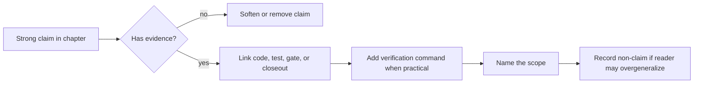

# Додаток Б: Матриця тверджень і доказів

Цей додаток потрібен не для краси. Він знімає головний ризик технічної книги-портфоліо: сильні твердження мають бути швидко перевірними. Якщо claim не веде до коду, milestone gate або команди відтворення, він має бути або пом'якшений, або прибраний.

## Як читати матрицю

* **Claim** — твердження, яке книга дозволяє собі зробити.
* **Code** — контракт або реалізація, яка несе поведінку.
* **Tests** — focused tests, які перевіряють behavioral boundary.
* **Measurement / Artifact** — milestone gate, closeout або команда, яка дає performance чи release evidence.
* **Scope** — межа, за яку claim не виходить.

## Audit Route

Цей маршрут важливий для стилю книги. Ми не прибираємо амбіцію; ми змушуємо кожне сильне речення пройти через доказ, команду або явно названу межу.

## Claim -> Code -> Test -> Measurement Index

| Claim | Code | Tests | Measurement / Artifact | Scope |
| :--- | :--- | :--- | :--- | :--- |
| `RadarStreamEvent` є compact hot-path contract | [RadarStreamEvent.cs](../../../src/Domain/Streaming/Streams/Models/RadarStreamEvent.cs), [RadarEventBatchBuilder.cs](../../../src/Domain/Streaming/Batches/Services/RadarEventBatchBuilder/RadarEventBatchBuilder.cs) | [RadarStreamContractTests.cs](../../../tests/RadarPulse.Tests/Streaming/Streams/RadarStreamContractTests.cs), [RadarEventBatchBuilderTests](../../../tests/RadarPulse.Tests/Streaming/Batches/RadarEventBatchBuilderTests) | [004 closeout](../../milestones/004-processing-core-input-contract-closeout.md), [Розділ 3](chapter_03_radar_batch.md) | Archive/replay hot path, not arbitrary live ingest |
| Stream benchmark досяг 500M+ payload values/s | [RadarEventBatchBuilder.cs](../../../src/Domain/Streaming/Batches/Services/RadarEventBatchBuilder/RadarEventBatchBuilder.cs) | [RadarStreamContractTests.cs](../../../tests/RadarPulse.Tests/Streaming/Streams/RadarStreamContractTests.cs) | `553_123_110.90` single-file, `509_716_417.97` cache-wide in [004 closeout](../../milestones/004-processing-core-input-contract-closeout.md) | Hardware/corpus-bound, not cross-machine certification |
| Manifest-first parsing avoids blind decompression | Archive block inspection and BZip2 workspace code | [Archive tests](../../../tests/RadarPulse.Tests/Archive) | [Розділ 2](chapter_02_nexrad_binaries.md), milestone `001`/`002` closeouts | File/corpus inspection path, not live stream claim |
| Architecture boundaries are executable | Domain/Application/Infrastructure/Presentation project structure | [RadarPulseArchitectureTests.cs](../../../tests/RadarPulse.Tests/Architecture/RadarPulseArchitectureTests.cs) | [Розділ 5](chapter_05_architecture_guards.md), [036 closeout](../../milestones/036-clean-architecture-hardening-closeout.md) | Guards declared boundaries, not a substitute for design review |
| `snapshot-copy` caused retained allocation crisis | [RadarProcessingRetainedPayloadFactory.SnapshotCopy.cs](../../../src/Infrastructure/Processing/Retention/Services/RadarProcessingRetainedPayloadFactory/RadarProcessingRetainedPayloadFactory.SnapshotCopy.cs) | [Retention factory tests](../../../tests/RadarPulse.Tests/Processing/Retention/RadarProcessingRetainedPayloadFactoryTests) | `9_947_507_832` retained bytes in [010 gate](../../milestones/010-owned-provider-overlap-cost-reduction-performance-gate.md) | Owned payload contour |
| `pooled-copy` reduced retained allocation by about `98.97%` | [RadarProcessingRetainedPayloadFactory.PooledCopy.cs](../../../src/Infrastructure/Processing/Retention/Services/RadarProcessingRetainedPayloadFactory/RadarProcessingRetainedPayloadFactory.PooledCopy.cs) | [PooledCopyRetention tests](../../../tests/RadarPulse.Tests/Processing/Retention/RadarProcessingRetainedPayloadFactoryTests) | `9_947_507_832` -> `102_811_264` bytes in [010 gate](../../milestones/010-owned-provider-overlap-cost-reduction-performance-gate.md) | Not total zero allocation; retained payload claim |
| Cold start is a separate measurable cost | [RadarProcessingRetainedPayloadFactory.Prewarm.cs](../../../src/Infrastructure/Processing/Retention/Services/RadarProcessingRetainedPayloadFactory/RadarProcessingRetainedPayloadFactory.Prewarm.cs) | [Retention factory tests](../../../tests/RadarPulse.Tests/Processing/Retention/RadarProcessingRetainedPayloadFactoryTests) | natural `138_151_728`, prewarmed `68_420_960`, borrowed `70_635_296`, misses `0` in [017 gate](../../milestones/017-file-level-default-readiness-and-cold-retained-ownership-cost-measurefile-gate.md) | Representative file probe |
| Worker mailboxes/backpressure are explicit runtime boundaries | Queueing session and async worker composition | [RadarProcessingQueuedProcessingSessionTests](../../../tests/RadarPulse.Tests/Processing/Queueing/RadarProcessingQueuedProcessingSessionTests) | [Розділ 10](chapter_10_async_transport.md) | Local process mailbox contract, not broker semantics |
| Shared mutable core was a real active-batch blocker | [RadarProcessingBatchDelta.cs](../../../src/Domain/Processing/Core/Models/RadarProcessingBatchDelta.cs) | [RadarProcessingBatchDeltaTests.cs](../../../tests/RadarPulse.Tests/Processing/Core/RadarProcessingBatchDeltaTests.cs) | [021 Slice 3 blocker](../../milestones/021-ordered-concurrent-runtime-archive-processing-slice-3-blocker.md) | Previous mutable-core model |
| Delta compute + ordered commit removed blocker with visible tax | [RadarProcessingBatchDelta.cs](../../../src/Domain/Processing/Core/Models/RadarProcessingBatchDelta.cs), ordered runtime session code | [RadarProcessingPersistentDurableProcessingSessionTests.cs](../../../tests/RadarPulse.Tests/Processing/Durable/RadarProcessingPersistentDurableProcessingSessionTests.cs) | `active=4 elapsed 0.994x`, allocation `1.006x` in [021 matrix](../../milestones/021-ordered-concurrent-runtime-archive-processing-ordered-full-cache-performance-matrix.md) | Correctness/bounded tax, not universal speedup |
| Stale topology recompute keeps topology churn correct | Topology manager and ordered recompute path | [Rebalance tests](../../../tests/RadarPulse.Tests/Processing/Rebalance) | `39_292` dispatches for `32_000`, allocation `1.137x`, elapsed `0.891x` in [022 gate](../../milestones/022-ordered-rebalance-topology-commit-processing-bottleneck-performance-matrix.md) | Synthetic processing-bottleneck workload |
| Durable envelope is an explicit FSM | [RadarProcessingDurableEnvelopeQueue.cs](../../../src/Infrastructure/Processing/Durable/Services/RadarProcessingDurableEnvelopeQueue/RadarProcessingDurableEnvelopeQueue.cs), [RadarProcessingDurableEnvelopeState.cs](../../../src/Domain/Processing/Durable/Models/RadarProcessingDurableEnvelopeState.cs) | [RadarProcessingDurableEnvelopeQueueTests.cs](../../../tests/RadarPulse.Tests/Processing/Durable/RadarProcessingDurableEnvelopeQueueTests.cs) | [Розділ 18](chapter_18_durable_envelope.md), [023 decision trace](../../milestones/023-durable-cross-process-runtime-readiness-decision-trace.md) | Local At-Least-Once semantics, not distributed exactly-once |
| File durable store supports local restart/recovery | [RadarProcessingFileDurableEnvelopeStore.cs](../../../src/Infrastructure/Processing/Durable/Stores/RadarProcessingFileDurableEnvelopeStore.cs) | Durable/persistent processing tests | [026 closeout](../../milestones/026-persistent-durable-adapter-readiness-closeout.md), [Розділ 19](chapter_19_file_store.md) | Temp-file replacement, not WAL/fsync/database durability |
| Fail-closed prevents silent corrupted progress | Product pipeline fallback/recovery code | [RadarProcessingProductionPipelineFallbackTests.cs](../../../tests/RadarPulse.Tests/Processing/ProductPipeline/RadarProcessingProductionPipelineFallbackTests.cs), [RadarProcessingProductionPipelineRecoveryTests.cs](../../../tests/RadarPulse.Tests/Processing/ProductPipeline/RadarProcessingProductionPipelineRecoveryTests.cs) | [Розділ 20](chapter_20_fail_closed.md) | Availability yields to correctness |
| Custom handlers are isolated by contract and posture | [IRadarSourceProcessingHandler.cs](../../../src/Domain/Processing/Handlers/Contracts/IRadarSourceProcessingHandler.cs), [RadarProcessingMvpRuntimePlan.cs](../../../src/Infrastructure/Processing/Runtime/Models/RadarProcessingMvpRuntimePlan.cs) | [Handler tests](../../../tests/RadarPulse.Tests/Processing/Handlers) | [Розділ 21](chapter_21_custom_handlers.md), [Розділ 22](chapter_22_delta_merge.md) | Snapshot fallback/unsupported block/mergeable fast path only |
| Handler delta/merge has correctness and performance gates | [RadarProcessingHandlerDeltaMergeCoordinator.cs](../../../src/Domain/Processing/Handlers/Services/RadarProcessingHandlerDeltaMergeCoordinator/RadarProcessingHandlerDeltaMergeCoordinator.cs) | [RadarProcessingHandlerDeltaMergeCoordinatorTests.cs](../../../tests/RadarPulse.Tests/Processing/Handlers/RadarProcessingHandlerDeltaMergeCoordinatorTests.cs), [RadarProcessingHandlerDeltaPerformanceGateTests](../../../tests/RadarPulse.Tests/Processing/Handlers/RadarProcessingHandlerDeltaPerformanceGateTests) | `counter-checksum-heavy active=4` allocation `2.612x` noted in [025 matrix](../../milestones/025-handler-delta-merge-contract-for-fast-custom-analytics-full-cache-performance-matrix.md) | Fast path has visible allocation debt |
| BFF protects UI from runtime internals | [RadarProcessingBffReadModelStore.cs](../../../src/Application/Processing/Services/RadarProcessingBffReadModelStore.cs), [RadarPulseProductHttpEndpoints.cs](../../../src/Presentation/RadarPulse.Http/Product/Endpoints/RadarPulseProductHttpEndpoints.cs) | [RadarProcessingBffReadModelStoreTests.cs](../../../tests/RadarPulse.Tests/Processing/ReadModels/RadarProcessingBffReadModelStoreTests.cs), [RadarPulseProductHttpControlTests.cs](../../../tests/RadarPulse.Tests/Product/Http/RadarPulseProductHttpControlTests.cs) | [Розділ 23](chapter_23_bff_shield.md) | Product/demo API, not public multi-tenant hardening |
| Operator UI is a local read-model cockpit | [Operator UI source](../../../src/Presentation/OperatorUi/src/app), [product API client](../../../src/Presentation/OperatorUi/src/app/product/product-api.client.ts) | [app.spec.ts](../../../src/Presentation/OperatorUi/src/app/app.spec.ts), [operator-ui.smoke.spec.ts](../../../src/Presentation/OperatorUi/smoke/operator-ui.smoke.spec.ts) | [Розділ 24](chapter_24_operator_ui.md), [031 closeout](../../milestones/031-operator-ui-hardening-and-integrated-local-delivery-closeout.md) | Not live radar canvas, not public security surface |
| Demo readiness is executable protocol | [radarpulse-product-demo.ps1](../../../scripts/radarpulse-product-demo.ps1), [radarpulse-product-demo.sh](../../../scripts/radarpulse-product-demo.sh) | Script verify route and product/API gates | [033 gate](../../milestones/033-product-demo-polish-and-portfolio-readiness-gate.md), [Розділ 25](chapter_25_demo_scripts.md) | Local deterministic demo packaging, not deployment automation |
| Diagnostic/readiness contract exists before production logging | [RadarProcessingRunDiagnosticsReadModel.cs](../../../src/Application/Processing/ReadModels/RadarProcessingRunDiagnosticsReadModel.cs), [RadarProcessingProviderQueueTelemetrySummary.cs](../../../src/Domain/Processing/Queueing/Telemetry/RadarProcessingProviderQueueTelemetrySummary.cs), [RadarProcessingProductionPipelineOperatorSummary.Blocking.cs](../../../src/Infrastructure/Processing/ProductPipeline/Models/RadarProcessingProductionPipelineOperatorSummary/RadarProcessingProductionPipelineOperatorSummary.Blocking.cs) | [RadarProcessingRunReadModelTests.cs](../../../tests/RadarPulse.Tests/Processing/ReadModels/RadarProcessingRunReadModelTests.cs), [RadarProcessingProductionPipelineSummaryTests.cs](../../../tests/RadarPulse.Tests/Processing/ProductPipeline/RadarProcessingProductionPipelineSummaryTests.cs), [RadarPulseProductPipelineDtoTests.cs](../../../tests/RadarPulse.Tests/Product/Pipeline/RadarPulseProductPipelineDtoTests.cs) | [Розділ 26](chapter_26_observability_logging.md), [Додаток В](appendix_c_production_hardening.md) | Typed diagnostics/readiness only; not `ILogger`/OpenTelemetry production observability |
| Lab stand can be bootstrapped without private author steps on Windows and Linux | [Archive CLI historical loader](../../../src/Presentation/RadarPulse.Cli/EntryPoint/RadarPulseCliApplication/ArchiveCliApplication/ArchiveCliApplication.Historical.cs), [RadarPulseCliUsage.cs](../../../src/Presentation/RadarPulse.Cli/EntryPoint/RadarPulseCliApplication/RadarPulseCliUsage.cs), [radarpulse-product-demo.ps1](../../../scripts/radarpulse-product-demo.ps1), [radarpulse-product-demo.sh](../../../scripts/radarpulse-product-demo.sh) | [Archive tests](../../../tests/RadarPulse.Tests/Archive), product package verify route | [Додаток Е](appendix_f_lab_stand_bootstrap.md), [Додаток Є](appendix_g_lab_stand_linux.md), [001 historical loader](../../milestones/001-historical-loader.md), [033 gate](../../milestones/033-product-demo-polish-and-portfolio-readiness-gate.md) | Public AWS/cache/bootstrap route; not guaranteed identical throughput across platforms |
| Reviewer can collect fresh performance evidence on Windows and Linux | [Archive benchmark stream CLI](../../../src/Presentation/RadarPulse.Cli/EntryPoint/RadarPulseCliApplication/ArchiveBenchmarkCliApplication/ArchiveBenchmarkCliApplication.StreamCommand.cs), [Processing benchmark CLI](../../../src/Presentation/RadarPulse.Cli/EntryPoint/RadarPulseCliApplication/ProcessingBenchmarkCliApplication.cs), [Processing benchmark reporters](../../../src/Presentation/RadarPulse.Cli/EntryPoint/RadarPulseCliApplication/ProcessingBenchmarkCliReporter) | Benchmark output includes checksum/completeness/allocation fields; Release build and archive tests support the path | [Додаток Е](appendix_f_lab_stand_bootstrap.md), [Додаток Є](appendix_g_lab_stand_linux.md), [036 performance evidence](../../milestones/036-clean-architecture-hardening-performance-evidence.md) | Local raw evidence bundle; not public comparative certification |

## Claims Deliberately Not Made

| Non-claim | Why it matters |
| :--- | :--- |
| True live radar network ingestion | The book proves local archive-shaped workflows; live NOAA/AWS ingestion needs a separate adapter and operations story |
| Exactly-once distributed delivery | Durable envelope is local and explicit; cross-machine exactly-once requires broker/database semantics outside this book |
| Public production hosting | BFF and UI are product/demo surfaces; TLS, auth, CORS hardening, reverse proxy and autoscaling are separate work |
| Production logging/OpenTelemetry stack | The book proves typed diagnostics/readiness/capacity evidence; structured logs, metrics exporters and traces are a future hardening adapter |
| Cross-machine throughput certification | Benchmarks are tied to local hardware, cache shape and corpus |
| Private data corpus requirement | The lab stand uses public NEXRAD archive data and deterministic cache paths; private author files are not required |
| Universal zero-allocation runtime | The book proves specific hot-path and retained-payload contours; total process allocation is not claimed as zero |

## Where To Go Next

* Для production-hardening маршруту див. [Додаток В](appendix_c_production_hardening.md).
* Для агресивного reviewer-аудиту див. [Додаток Г](appendix_d_reviewer_attack_pack.md).
* Для відтворення локального стенда з чистого checkout і збору raw performance logs на Windows див. [Додаток Е](appendix_f_lab_stand_bootstrap.md), на Linux/macOS/WSL2 — [Додаток Є](appendix_g_lab_stand_linux.md).

Ця матриця не замінює книгу; вона дає рецензенту карту, де саме копати.
