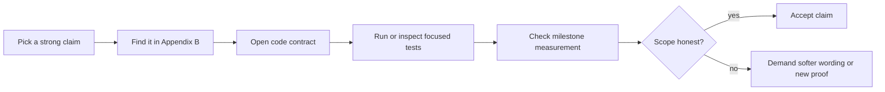

# Додаток Г: набір атак рецензента (Reviewer Attack Pack)

Цей додаток написаний для сильного рецензента. Його мета — не захищати книгу від критики, а зробити критику швидкою, точною і корисною.

Якщо після читання книги експерт не має питань, книга або занадто поверхова, або занадто самовпевнена. RadarPulse має витримати інший режим: рецензент атакує найсильніші claims, а автор веде його до коду, тестів, gate-ів і scope limits без довгих пояснень.

Повна simulated-сесія з follow-up, verdict і production-proof нотатками винесена в [Додаток Д](appendix_e_simulated_hostile_reviewer_transcript.md). Цей attack pack лишається короткою картою питань; Додаток Д показує, як має звучати захист.

## 30-хвилинний маршрут рецензента (30-minute reviewer route)

Цей маршрут потрібен перед довгими додатками. Він не замінює лабораторний запуск і не просить вірити цифрам на слово. Його задача простіша: за пів години зрозуміти, чи книга варта глибокого review, і які саме claims треба атакувати першими.

| Час | Що відкрити | Що перевірити |
| :--- | :--- | :--- |
| 0-4 хв | [Executive Verdict](preface_executive_verdict.md) | Чи заявлено scope: локальний lab table, не production cloud platform |
| 4-9 хв | [Додаток Б](appendix_b_claim_evidence_matrix.md) | Чи кожен сильний claim має code/test/measurement/scope, а non-claims названі явно |
| 9-16 хв | [Розділ 3](chapter_03_radar_batch.md) і [Розділ 12](chapter_12_pooled_copy.md) | Чи performance story спирається на memory layout, retained ownership і milestone evidence, а не на лозунг “швидко” |
| 16-23 хв | [Розділ 16](chapter_16_mutable_core.md), [Розділ 17](chapter_17_stale_recompute.md), [Розділ 26](chapter_26_observability_logging.md) | Чи concurrency, topology і diagnostics мають failure-mode thinking, а не тільки happy path |
| 23-30 хв | Цей attack pack нижче; за потреби — тільки секції `E.9`/`Є.9` у platform runbook-ах | Які два-три питання варто поставити автору наживо і чи є маршрут до відтворення без приватних інструкцій |

Якщо після цього reviewer бачить тільки красиві слова, книгу треба зупиняти. Якщо бачить повторюваний ланцюг `claim -> code -> test -> measurement -> scope`, довгі додатки мають сенс: вони вже не “документація заради документації”, а протокол незалежної перевірки.

## Швидкий маршрут атаки

## Найсильніші питання рецензента

| Атака (Attack) | Що саме перевіряє | Куди йти в книзі | Куди йти в коді/доказах | Очікувана відповідь автора |
| :--- | :--- | :--- | :--- | :--- |
| “500M+ values/s звучить як маркетинг. Де raw evidence?” | Чи throughput має milestone, corpus і hardware boundary | [Розділ 3](chapter_03_radar_batch.md), [Додаток Б](appendix_b_claim_evidence_matrix.md) | [004 closeout](../../milestones/004-processing-core-input-contract-closeout.md), [RadarStreamContractTests.cs](../../../tests/RadarPulse.Tests/Streaming/Streams/RadarStreamContractTests.cs) | Це локальний benchmark на конкретному corpus/hardware, не універсальна сертифікація |
| “Я хочу сам зібрати performance logs, а не читати ваш milestone” | Чи performance story повторюється без автора на обраній платформі | [Додаток Е](appendix_f_lab_stand_bootstrap.md), [Додаток Є](appendix_g_lab_stand_linux.md), [Додаток Б](appendix_b_claim_evidence_matrix.md) | [Archive benchmark stream CLI](../../../src/Presentation/RadarPulse.Cli/EntryPoint/RadarPulseCliApplication/ArchiveBenchmarkCliApplication/ArchiveBenchmarkCliApplication.StreamCommand.cs), [ProcessingBenchmarkCliApplication.cs](../../../src/Presentation/RadarPulse.Cli/EntryPoint/RadarPulseCliApplication/ProcessingBenchmarkCliApplication.cs), [036 performance evidence](../../milestones/036-clean-architecture-hardening-performance-evidence.md) | Reviewer створює `data/perf/reviewer-*`, фіксує environment/build/cache contour і збирає raw logs через `Tee-Object` на Windows або `tee` на Linux/macOS/WSL2; цифри лишаються local evidence |
| “Чому не zero-copy cast по NEXRAD bytes?” | Чи автор розуміє binary format boundary | [Розділ 3](chapter_03_radar_batch.md) | [RadarEventBatchBuilder.cs](../../../src/Domain/Streaming/Batches/Services/RadarEventBatchBuilder/RadarEventBatchBuilder.cs), [RadarEventBatchBuilderTests](../../../tests/RadarPulse.Tests/Streaming/Batches/RadarEventBatchBuilderTests) | NEXRAD має endian/variable payload/schema boundary; builder нормалізує формат у доменний контракт |
| “98.97% allocation reduction не ховає інші allocation costs?” | Чи claim не ширший за measurement | [Розділ 11](chapter_11_allocation_anomaly.md), [Розділ 12](chapter_12_pooled_copy.md) | [010 performance gate](../../milestones/010-owned-provider-overlap-cost-reduction-performance-gate.md), [RadarProcessingRetainedPayloadFactory.PooledCopy.cs](../../../src/Infrastructure/Processing/Retention/Services/RadarProcessingRetainedPayloadFactory/RadarProcessingRetainedPayloadFactory.PooledCopy.cs) | Claim тільки про retained payload contour, не про total process allocation |
| “Чому active=4 не заявлено як speedup?” | Чи автор не продає concurrency неправильно | [Розділ 14](chapter_14_concurrency_chaos.md), [Розділ 16](chapter_16_mutable_core.md) | [021 matrix](../../milestones/021-ordered-concurrent-runtime-archive-processing-ordered-full-cache-performance-matrix.md), [project-progress.md](../../project-progress.md) | Основний claim — correctness і bounded tax; speedup залежить від bottleneck shape |
| “Як ви довели, що shared mutable core був реально небезпечний?” | Чи blocker не вигаданий після факту | [Розділ 16](chapter_16_mutable_core.md) | [021 Slice 3 blocker](../../milestones/021-ordered-concurrent-runtime-archive-processing-slice-3-blocker.md), [RadarProcessingBatchDelta.cs](../../../src/Domain/Processing/Core/Models/RadarProcessingBatchDelta.cs) | Старий design змішував compute і mutation; delta/ordered commit розірвав цей шлях |
| “Що стається, якщо topology змінюється під час compute?” | Чи topology migration має correctness story | [Розділ 17](chapter_17_stale_recompute.md) | [022 processing-bottleneck matrix](../../milestones/022-ordered-rebalance-topology-commit-processing-bottleneck-performance-matrix.md), [022 closeout](../../milestones/022-ordered-rebalance-topology-commit-closeout.md) | Стара delta не коммітиться; recompute має виміряну allocation/dispatch ціну |
| “DurableEnvelope — це саморобна Kafka?” | Чи local queue не видається за broker | [Розділ 18](chapter_18_durable_envelope.md), [Розділ 19](chapter_19_file_store.md) | [RadarProcessingDurableEnvelopeQueue.cs](../../../src/Infrastructure/Processing/Durable/Services/RadarProcessingDurableEnvelopeQueue/RadarProcessingDurableEnvelopeQueue.cs), [RadarProcessingFileDurableEnvelopeStore.cs](../../../src/Infrastructure/Processing/Durable/Stores/RadarProcessingFileDurableEnvelopeStore.cs) | Ні. Це broker-neutral FSM і local file adapter; production broker adapter є окремим hardening step |
| “File store справді durable?” | Чи файлова персистентність не перебільшена | [Розділ 19](chapter_19_file_store.md), [Додаток В](appendix_c_production_hardening.md) | [RadarProcessingFileDurableEnvelopeStore.cs](../../../src/Infrastructure/Processing/Durable/Stores/RadarProcessingFileDurableEnvelopeStore.cs), [026 closeout](../../milestones/026-persistent-durable-adapter-readiness-closeout.md) | Це temp-file replacement для local restart/recovery, не WAL/fsync/database durability |
| “Fail-closed не просто availability killer?” | Чи автор розуміє trade-off correctness vs availability | [Розділ 20](chapter_20_fail_closed.md) | [RadarProcessingProductionPipelineFallbackTests.cs](../../../tests/RadarPulse.Tests/Processing/ProductPipeline/RadarProcessingProductionPipelineFallbackTests.cs), [RadarProcessingProductionPipelineRecoveryTests.cs](../../../tests/RadarPulse.Tests/Processing/ProductPipeline/RadarProcessingProductionPipelineRecoveryTests.cs) | Так, availability свідомо поступається correctness, бо wrong metric дорожча за зупинку |
| “Custom handlers не повертають shared-state chaos?” | Чи extension model має isolation contract | [Розділ 21](chapter_21_custom_handlers.md), [Розділ 22](chapter_22_delta_merge.md) | [IRadarSourceProcessingHandler.cs](../../../src/Domain/Processing/Handlers/Contracts/IRadarSourceProcessingHandler.cs), [RadarProcessingMvpRuntimePlan.cs](../../../src/Infrastructure/Processing/Runtime/Models/RadarProcessingMvpRuntimePlan.cs), [RadarProcessingHandlerDeltaMergeCoordinatorTests.cs](../../../tests/RadarPulse.Tests/Processing/Handlers/RadarProcessingHandlerDeltaMergeCoordinatorTests.cs) | Handler posture керує runtime path: snapshot-only fallback, unsupported block, mergeable delta/merge |
| “BFF/UI не приховують production gaps?” | Чи product surface чесно називає non-claims | [Розділ 23](chapter_23_bff_shield.md), [Розділ 24](chapter_24_operator_ui.md) | [RadarPulseProductDemoReadiness.cs](../../../src/Presentation/RadarPulse.Http/Product/Readiness/RadarPulseProductDemoReadiness.cs), [RadarPulseProductHttpControlTests.cs](../../../tests/RadarPulse.Tests/Product/Http/RadarPulseProductHttpControlTests.cs), [app.spec.ts](../../../src/Presentation/OperatorUi/src/app/app.spec.ts) | BFF/UI є local product cockpit; live canvas, auth/TLS, traffic optimization і public hosting не claimed |
| “Чи можна відтворити демо без автора?” | Чи книга завершується executable workflow | [Розділ 25](chapter_25_demo_scripts.md) | [radarpulse-product-demo.ps1](../../../scripts/radarpulse-product-demo.ps1), [radarpulse-product-demo.sh](../../../scripts/radarpulse-product-demo.sh), [product-demo-readiness.md](../../product-demo-readiness.md) | Одна команда має провести reviewer-а через build/test/smoke/readiness route |
| “Де ваші production logs?” | Чи observability не підмінена `Console.WriteLine` або красивим UI | [Розділ 26](chapter_26_observability_logging.md), [Додаток В](appendix_c_production_hardening.md) | [RadarProcessingRunDiagnosticsReadModel.cs](../../../src/Application/Processing/ReadModels/RadarProcessingRunDiagnosticsReadModel.cs), [RadarProcessingProviderQueueTelemetrySummary.cs](../../../src/Domain/Processing/Queueing/Telemetry/RadarProcessingProviderQueueTelemetrySummary.cs), [RadarProcessingProductionPipelineOperatorSummary.Blocking.cs](../../../src/Infrastructure/Processing/ProductPipeline/Models/RadarProcessingProductionPipelineOperatorSummary/RadarProcessingProductionPipelineOperatorSummary.Blocking.cs) | Production logging не claimed; доведено typed diagnostic/readiness contract, який має стати джерелом structured logs/metrics/traces |
| “Чи можна відтворити ваш NEXRAD cache з нуля?” | Чи performance/runtime evidence не залежить від приватної папки автора | [Додаток Е](appendix_f_lab_stand_bootstrap.md), [Додаток Є](appendix_g_lab_stand_linux.md), [Розділ 1](chapter_01_lab_table.md), [Розділ 25](chapter_25_demo_scripts.md) | [ArchiveCliApplication.Historical.cs](../../../src/Presentation/RadarPulse.Cli/EntryPoint/RadarPulseCliApplication/ArchiveCliApplication/ArchiveCliApplication.Historical.cs), [RadarPulseCliUsage.cs](../../../src/Presentation/RadarPulse.Cli/EntryPoint/RadarPulseCliApplication/RadarPulseCliUsage.cs), [001 historical loader](../../milestones/001-historical-loader.md) | Так: public AWS Open Data -> manifest -> deterministic `data/nexrad`; Windows і Linux мають окремі runbook-и, throughput лишається hardware/corpus-bound |

## Питання, на які автор не повинен відповідати “вже зроблено”

| Питання | Чесна відповідь |
| :--- | :--- |
| “Чи є production auth/TLS?” | Ні. Є same-origin local delivery; production security — окремий hardening step |
| “Чи є centralized logging/OpenTelemetry?” | Ні. Є diagnostic/readiness/capacity contract; exporter-и і trace/log schema — окремий observability hardening step |
| “Чи є Kafka/RabbitMQ adapter?” | Ні. Є broker-neutral envelope semantics і local file adapter |
| “Чи є live radar network ingestion?” | Ні. Є archive/replay-shaped workflow і місце для ingestion adapter |
| “Чи потрібен приватний авторський cache?” | Ні. Додатки Е/Є описують public NEXRAD bootstrap для Windows і Linux/macOS/WSL2; точні performance цифри все одно залежать від corpus/hardware |
| “Чи є true exactly-once distributed delivery?” | Ні. Є At-Least-Once semantics, idempotency/fail-closed thinking і explicit non-claim |
| “Чи є 60 FPS radar canvas?” | Ні. Поточний UI — read-model cockpit; live visualization потребує окремого DTO/transport/browser gate |
| “Чи active=4 завжди швидше?” | Ні. Книга доводить correctness і measured envelope; speedup залежить від workload bottleneck |

## Як виглядає сильна відповідь на захисті

Слабка відповідь захищає кожне рішення як ідеальне. Сильна відповідь звучить інакше:

> “Ось що я довів. Ось де це в коді. Ось gate, який це підтверджує. Ось межа claim-а. Ось що я зробив би наступним, якби це стало production-вимогою.”

Саме такий режим технічного захисту ця книга має провокувати.
