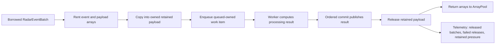

# Розділ 12: Оренда проти купівлі, або Справа про багаторазові папки

Якщо вашому поліцейському відділку щодня потрібно підшивати тисячі нових звітів, купувати під кожен звіт нову шкіряну папку, а після закриття справи спалювати її разом із документами — це фінансове божевілля. Будь-який аудитор скаже вам: «Використовуйте стандартні картонні папки з архівного складу. Коли справа закривається, дістаньте документи, відправте їх у подрібнювач, а порожню папку поверніть на склад, щоб інший детектив міг підшити туди нове розслідування».

Саме ця проста логіка лежить в основі оптимізації, яку ми провели в межах Milestones 010-012, замінивши марнотратну стратегію `snapshot-copy` на ощадливу систему оренди ресурсів — **pooled-copy retained payload**.

## 12.1. Повернення до пулу: Робота з ArrayPool

Щоб вирішити проблему 9.95 гігабайт сміття, про яку йшлося в Розділі 11, ми інтегрували в серце RadarPulse стандартний механізм .NET для повторного використання масивів — `System.Buffers.ArrayPool<T>`.

Замість того, щоб щоразу виділяти нову пам'ять у купі за допомогою оператора `new`, наш метод створення власних знімків перейшов на нові рейки:
1. **Оренда з пулу:** Коли потрібно скопіювати події з батчу, система звертається до пулу: `ArrayPool<RadarStreamEvent>.Shared.Rent(eventCount)`.
2. **Оренда байтів:** Для копіювання байтів корисного навантаження ми так само орендуємо масив потрібного розміру з байтового пулу: `ArrayPool<byte>.Shared.Rent(payloadLength)`.
3. **Копіювання:** Дані копіюються в орендовані масиви.
4. **Обробка:** Знімок стає в чергу і передається воркерам.
5. **Повернення (Release):** Це найкритичніша частина. Як тільки воркер завершує обробку знімка, а координатор фіксує результати в загальному журналі, знімок викликає метод `Release()`. Орендовані масиви повертаються назад у пул: `ArrayPool<T>.Shared.Return(array, clearArray: false)`.

Тут діють два важливі інженерні правила:
* **Анатомія бакетів ArrayPool:** Пул масивів виділяє пам'ять фіксованими блоками (бакетами), розміри яких округлюються до найближчого степеня двійки. Якщо нам потрібен масив під 32,400 подій, пул орендує нам масив розміром 32,768 елементів. Ми повинні оперувати лише межами логічної довжини батчу (через `Span.Slice`), ігноруючи зайвий хвіст орендованого масиву.
* **Оптимізація `clearArray: false`:** При поверненні масиву в пул ми викликаємо `Return(array, clearArray: false)`. Якщо встановити `clearArray: true`, CLR примусово занулить усі 32,768 елементів у пам'яті. Для контуру, де ми вже вимірюємо сотні мільйонів payload values/s, зайве занулення стало б окремим податком на memory bandwidth. Ми вимикаємо занулення для гарячого контуру, але це зобов'язує нас жорстко контролювати межі оренди, щоб не допустити читання залишків старих даних наступними воркерами (use-after-free).

Життєвий цикл орендованого ресурсу став залізобетонним. Якщо детектив взяв папку зі складу, він зобов'язаний повернути її туди після закриття справи. Якщо він забуде це зробити — виникне витік пам'яті (leak). Якщо він спробує повернути її двічі або продовжить читати дані після повернення — виникне спотворення даних (use-after-free).

Для захисту від таких помилок ми впровадили строгий контракт **Retained Resource Lifecycle**. Кожен орендований знімок відстежує свій статус використання і веде лічильник активних власників. Тільки коли останній споживач звільняє посилання — масиви повертаються в пул.

Якщо прибрати метафору з папками, ownership-схема виглядає так:



Ця схема важлива для рецензента: `pooled-copy` не є “просто ArrayPool”. Це ownership protocol. Якщо забрати будь-який крок між enqueue і release, ми або повернемося до `snapshot-copy` сміття, або відкриємо use-after-free.

## 12.2. Тріумф цифр: Оптимізація на 98.97%

Цього разу цифри не потребували прикрас. Ми запустили той самий full-cache контур на 198 файлах NEXRAD зі стратегією `pooled-copy` і отримали не косметичну правку, а зміну характеру системи:

* **Раніше (snapshot-copy):** 9_947_507_832 байт виділеної пам'яті (9.95 ГБ).
* **Тепер (pooled-copy):** 102_811_264 байт виділеної пам'яті (102 МБ).
* **Ефективність:** Скорочення виділень пам'яті склало **98.97%**!

Це не означало, що пам'ять стала безкоштовною. Це означало, що ми перестали платити за неї знову і знову на кожному батчі. Замість гігантських обсягів макулатури купа містила керований набір довгоживучих масивів, які поверталися в пул і повторно використовувалися. GC більше не був головним героєм профілю.

Але це було ще не все. Завдяки тому, що snapshot-copy більше не засмічував картину, ми нарешті змогли чесно подивитися на **Overlap Runner** — конвеєр, у якому провайдер читає наступний файл з диска, поки воркери ще обробляють попередній. У повторному gate контур `queued-owned async / pooled-copy / none` пройшов за `17_158.62 ms`, а `queued-owned overlap async / pooled-copy / capacity 8` — за `14_947.99 ms`. Це не універсальна обіцянка “завжди швидше”, а конкретний доказ: після приборкання пам'яті pipeline-паралельність стала вимірюваною і корисною.

## 12.3. Випробування на міцність: Controlled Queue-Ahead Proof

Щоб перевірити, чи здатна наша система витримувати великі перевантаження без виходу з ладу, ми розробили спеціальний стрес-тест — **Controlled Queue-Ahead Proof** (Контрольований тест випередження черги).

Ми штучно уповільнили споживача даних (воркерів), додавши затримку в 150 мілісекунд на кожен батч (`overlap consumer delay`). Провайдер при цьому продовжував читати файли з максимальною швидкістю.

Мета тесту — перевірити, як поводиться черга, коли провайдер намагається забити її вщерть:
1. **Зростання черги:** Черга швидко досягла свого ліміту ємності (`queue capacity 8`).
2. **Активація ліміту пам'яті:** Об'єм пам'яті, утримуваної в орендованих знімках, почав зростати, досягнувши пікового значення в **386 megabytes** (при жорсткому ліміті `retained-byte budget` у 536 megabytes).
3. **Блокування провайдера:** Спрацював механізм backpressure. Провайдер був призупинений і простояв в очікуванні звільнення місця сумарно 16.5 секунд.
4. **Повне прибирання:** Коли тест завершився, всі орендовані масиви були успішно повернуті в пул. Метрика поточного тиску пам'яті повернулася до значення **0**. Лічильник помилок звільнення (`release failures`) показав рівно 0.

Цей тест довів більш точну й важливу річ: локальний queued-owned контур не розганяється сліпо. Він уміє балансувати між швидкістю та безпекою, не дозволяючи асинхронним чергам непомітно з'їсти оперативну пам'ять.

Стратегія `pooled-copy` закрила проблему сміття на довгих дистанціях. Однак, коли ми спробували запустити швидкі тести на окремих коротких файлах (`MeasureFile()`), ми побачили дивну аномалію. Незважаючи на пул, перші запуски все одно показували високий рівень виділення пам'яті.

Це була остання загадка в нашому детективному розслідуванні — проблема холодного старту, про яку ми розповімо в Розділі 13.
---

## 🔍 Матеріали справи (Investigation Case Files)

### 1. Вердикт детективів (Decision Trace & Rationale)
Перехід на стратегію `pooled-copy retained payload` (Віхи `010`-`012`). Замість виділення нових масивів під кожне зчитування, буфери орендуються з `ArrayPool<byte>` і повертаються туди після завершення фази комміту. Це дозволило зменшити алокацію на 98.97% (до 102 МБ).

#### Чому ми орендуємо пам'ять, а не купуємо її щоразу
Після 9.95 ГБ сміття були три дороги: заборонити queued-owned overlap, копіювати менше, або навчити систему повертати великі папки на полицю. Заборона overlap зберігала б чисту пам'ять, але програвала б pipeline-паралельності. Часткові копії ускладнили б ownership і ризикували б прихованими aliasing-помилками. Pooled-copy залишив семантику owned batch, але змінив спосіб оплати: масиви не купуються щоразу, а орендуються й повертаються. Ціна вибору — сувора дисципліна `Return` і telemetry pool-miss; виграш — контрольований retained pressure без втрати overlap.

### 2. Закони фізики рантайму (System Invariants)
* **Обов'язкове повернення**: Кожен орендований буфер має бути детерміновано повернений в пул через `ArrayPool.Return()` у блоці `finally`.
* **Steady-state allocation discipline**: Відсутність нових retained payload масивів під час steady-state обробки має підтверджуватися telemetry pool-miss/release counters, а не припущенням.

### 3. Патологоанатомічний звіт (Failure Modes & Recovery)
* **Витік буферів**: Якщо воркер втратить посилання на орендований масив без повернення, пул вичерпається, і система знову почне виділяти пам'ять з кучі, про що свідчитиме зростання лічильника `PoolMissCount`.

### 4. Докази продуктивності (Performance Evidence)

| Твердження (Claim) | Доказ (Evidence) | Де дивитися |
| :--- | :--- | :--- |
| `pooled-copy` прибрав основну алокаційну кризу без зміни owned-семантики | Full-cache gate: `snapshot-copy` `9_947_507_832` bytes -> `pooled-copy` `102_811_264` bytes, приблизно `98.97%` reduction | [010-owned-provider-overlap-cost-reduction-performance-gate.md](../../milestones/010-owned-provider-overlap-cost-reduction-performance-gate.md) |
| Overlap став предметом чесного вимірювання після зняття snapshot-copy шуму | Repeat gate: `queued-owned async / pooled-copy / none` `17_158.62 ms`, `queued-owned overlap async / pooled-copy / capacity 8` `14_947.99 ms` | [010-owned-provider-overlap-cost-reduction-performance-gate.md](../../milestones/010-owned-provider-overlap-cost-reduction-performance-gate.md) |
| Release-дисципліна не залишилася на словах | Gate фіксує complete lifecycle cleanup: 198 retained batches, 198 released batches, 0 failed releases | [010-owned-provider-overlap-cost-reduction-performance-gate.md](../../milestones/010-owned-provider-overlap-cost-reduction-performance-gate.md) |

### 5. Слід доказової бази (Implementation & Tests)
* Адаптер пулу: [RadarProcessingPooledCopyRetentionStrategy.cs](../../../src/Infrastructure/Processing/Retention/Services/RadarProcessingRetainedPayloadFactory/RadarProcessingRetainedPayloadFactory.PooledCopy.cs)
* Управління пулами масивів: [RadarProcessingRetainedPayloadByteArrayPool.cs](../../../src/Infrastructure/Processing/Retention/Services/RadarProcessingRetainedPayloadByteArrayPool.cs)
* Performance gate і closeout: [010-owned-provider-overlap-cost-reduction-performance-gate.md](../../milestones/010-owned-provider-overlap-cost-reduction-performance-gate.md), [010-owned-provider-overlap-cost-reduction-closeout.md](../../milestones/010-owned-provider-overlap-cost-reduction-closeout.md)

### 6. Протокол допиту процесу (Verification Commands)
Перевірка алокацій пулу байтових масивів:
```bash
dotnet test tests/RadarPulse.Tests/RadarPulse.Tests.csproj --filter "FullyQualifiedName~PooledCopy"
```
