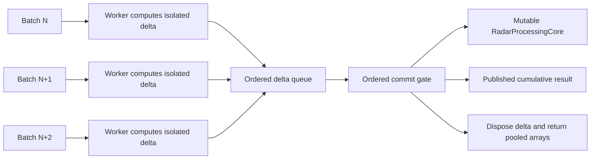

# Розділ 16: Справа про мутабельне ядро (Блокер Slice 3)

В історії розробки RadarPulse було одне розслідування, яке ледь не поставило під загрозу всю ідею паралельного обробника. Це сталося під час роботи над віхою `021`, коли команда спробувала здійснити перехід від звичайного впорядкування результатів на виході до реальної багатопотокової обробки сесій.

Цей інцидент увійшов до журналів під кодовою назвою **Slice 3 Blocker**. Детективам архітектури довелося зіткнутися з серйозним злочином проти пам'яті комп'ютера, де підозрюваними виступили самі потоки виконання.

---

## 16.1. Аномалія паралельної мутації

До виникнення блокера Slice 3 клас `RadarProcessingCore` був класичним монолітом із накопичувальним станом. Усередині нього містився об'єкт `RadarSourceProcessingStateStore`, який зберігав масиви даних про кожне радарне джерело (кількість оброблених подій, суми значень, мітки часу тощо).

Коли система працювала в один потік, усе було чудово. Батч надходив, воркер брав його, викликав метод обробки, і подія за подією оновлював спільні масиви в пам'яті. Коли обробка завершувалася, ядро інкрементувало лічильник оброблених пакетів (`processedBatchCount`) і створювало кумулятивний звіт `RadarProcessingResult`.

Але щойно ми відкрили шлюзи паралелізму і дозволили кільком воркерам одночасно обробляти різні батчі в межах однієї сесії, вибухнула катастрофа:

```text
[Воркер 1 (Батч 1)] ────┐
                        ├─► [Спільний RadarProcessingCore] ──► Зруйнований стан!
[Воркер 2 (Батч 2)] ────┘
```

1. **Стан перегонів у спільній пам'яті (State Race Conditions):**
   Потоки почали перезаписувати пам'ять один одного. Воркер №1 оновлював лічильники подій для джерела №45, і в цей же мікросекундний момент Воркер №2 робив те саме для того ж джерела. В результаті значення перезаписувалися хаотично, губилися події, а фінальні контрольні суми (`RawValueChecksum`) відхилялися від еталона.
2. **Брудне читання метрик (Dirty Cumulative Reads):**
   Навіть якщо воркери працювали з різними, непересічними радарними джерелами, метод побудови фінального звіту `CreateMetrics` зчитував накопичений стан ядра в той момент, коли інші паралельні воркери продовжували його мутувати. Як результат, звіти про роботу окремих батчів містили «фрагменти майбутнього» або «привиди минулого» інших потоків. Метрики ставали випадковими.
3. **Хибна видимість міграції топології:**
   У сесії ребалансу `RadarProcessingRebalanceSession` рішення про зміну топології (перерозподіл шардів) обчислювалося на основі завантаження ядра. Якщо результати обробки батчів фіксувалися позачергово, система могла прийняти рішення про міграцію на основі застарілих або неповних даних, що призводило до втрати зв'язку між подіями та їхніми законними власниками-шардами.

Блокер Slice 3 сформулював жорстокий діагноз: *«Мутаційна семантика RadarProcessingCore не може безпечно підтримувати перекриття батчів без ізоляції стану, злиття або шару впорядкованого комміту»*. Просте буферизоване впорядкування на виході, яке ми створили в попередньому розділі, захищало лише спостерігача, але воно не могло повернути час назад і скасувати руйнівні мутації, що вже відбулися в пам'яті.

---

## 16.2. Поділ праці: Дельта та впорядкована фіксація (Ordered Commit)

Рішенням став повний демонтаж монолітної мутаційної моделі. Ми розділили життєвий цикл обробки батча на дві ізольовані фази, що повністю виключило конфлікти потоків.

```
       Паралельна немутабельна фаза (Concurrent Compute)
[Батч 1] ──► Воркер 1 ──► [RadarProcessingBatchDelta 1 (Ізольовано)] ──┐
                                                                       │
[Батч 2] ──► Воркер 2 ──► [RadarProcessingBatchDelta 2 (Ізольовано)] ──┼─► [впорядкована фіксація (Ordered Commit) Gate]
                                                                       │     (Послідовний запис)
[Батч 3] ──► Воркер 3 ──► [RadarProcessingBatchDelta 3 (Ізольовано)] ──┘
```

У вигляді архітектурної схеми це рішення має один головний нерв: воркери можуть масштабувати compute, але тільки ordered commit має право торкатися shared core.



### Фаза 1: Немутабельне обчислення дельти (Delta Compute)
Воркери більше не мають права підходити до спільного стану `RadarProcessingCore`. Вони працюють у повній ізоляції. Кожен воркер обчислює зміни лише для свого конкретного батча і записує їх у спеціальний тимчасовий контейнер — `RadarProcessingBatchDelta`.
Цей об'єкт є повністю немутабельним для зовнішнього світу і містить лише локальні зміни (дельти), які приносить цей конкретний пакет даних: скільки нових подій додалося, які суми контрольних сум вони несуть, які мітки часу зафіксовані для джерел.

Щоб не створювати гігантського навантаження на збирач сміття .NET (GC), об'єкт `RadarProcessingBatchDelta` розроблений як орендар пам'яті. Він орендує плоскі масиви з пулу `ArrayPool<long>` та `ArrayPool<int>`, а після завершення роботи обов'язково утилізується через метод `Dispose`, повертаючи масиви в пул для повторного використання іншими воркерами. Це прибрало неконтрольовані довгоживучі алокації з гарячого шляху й залишило невеликий, виміряний allocation tax.

### Фаза 2: Впорядкований комміт (Ordered Commit, впорядкована фіксація)
Коли Старшина черги вирішує, що настав час зафіксувати результати певного батча, його дельта потрапляє у вузьке горлечко послідовного запису. Метод `CommitProcessingDelta` виконується строго в один потік, по черзі:

1. Координатор бере `RadarProcessingBatchDelta` для поточного sequence.
2. Він перевіряє хронологічну послідовність міток часу (source-local timestamp) щодо вже записаного стану ядра.
3. Він застосовує дельту до спільних масивів ядра.
4. Він створює кумулятивний звіт `RadarProcessingResult` на основі тепер уже стабільного та цілісного стану.
5. Дельта утилізується (`Dispose`), повертаючи пам'ять у пул.

Цей архітектурний хід дозволив зняти блокування Slice 3. Важливий нюанс: це не була історія про те, як одним `lock` отримати більше швидкості. Це була історія про право системи взагалі тримати кілька активних батчів у польоті, не змішуючи їхні часткові стани.

## 16.3. Метрики безпечної паралельності: 4 active batches проти 1

Розділення обчислень на дві фази дозволило нам провести чесні заміри на нашому Ryzen 9 верстаку. І найкраща новина була не в гучному множнику, а в тому, що safety tax залишився маленьким і видимим:
* **Active-batch runtime без регресії:** прямий full-cache matrix для ordered archive processing показав `active=4` на рівні `0.994x` elapsed проти `active=1` у Milestone 021, а пізніший Milestone 022 утримав той самий контур біля `0.999x`.
* **Контрольований allocation tax:** steady allocation ratio залишився близьким до бази: `1.006x` у Milestone 021 і `1.007x` у Milestone 022. Це не “нульова ціна”, але це ціна, яку можна побачити, обговорити й прийняти.
* **Детермінізм:** контрольні суми збіглися, processing completeness пройшов, worker failed batches/items залишилися `0/0`, release failures — `0`.

Цей архітектурний трюк дав нам важливий аргумент: Clean Architecture та високопродуктивні обчислення можуть співіснувати в C#, якщо швидкість не купувати ціною прихованої спільної мутації.

## 16.4. Межа безпеки: Відхилення кастомних обробників

Під час впровадження цієї схеми виникла ще одна проблема. Що робити з користувацькими аналітичними обробниками (custom handlers), які підключаються до системи для виконання специфічного аналізу?

Оскільки кастомні обробники пишуться сторонніми розробниками, вони часто мають власний складний мутабельний стан. Вони не вміють працювати за схемою «обчисли дельту, а потім злий її зі спільним станом».

Для безпеки архітектура RadarPulse під час віхи `021` отримала правило-запобіжник: custom handler-и без доведеного delta/merge contract не допускаються у впорядкований паралельний шлях обробки. Snapshot-only handler-и примушують sequential fallback, unsupported handler set блокує MVP processing, а mergeable handler-и отримують право на швидкий шлях лише після явного контракту злиття дельт. Це не заборона розширень; це вимога довести детермінізм перед тим, як розширення торкнеться concurrency.
---

## 🔍 Матеріали справи (Investigation Case Files)

### 1. Вердикт детективів (Decision Trace & Rationale)
Усунення критичного архітектурного блокера Slice 3. Замість безпосередньої модифікації спільного мутабельного стану ядра паралельними воркерами, обчислення розділено на дві фази:
1. Паралельний розрахунок воркерами немутабельних дельт (`RadarProcessingBatchDelta`).
2. Послідовне застосування дельт (Ordered Commit, впорядкована фіксація) в одному потоці.

#### Чому ядро перестало бути спільним блокнотом
Можна було захистити мутабельне ядро lock-ами й дозволити воркерам писати прямо в нього. Це швидко в реалізації, але під навантаженням перетворює ядро на вузький прохід і відкриває двері dirty reads. Можна було зробити окрему копію стану для кожного воркера, але тоді алокації й merge-cost стали б новою кризою. Ми обрали дельти: воркер лише рахує доказову різницю, а один ordered commit застосовує її до ядра. Ціна вибору — додаткова модель `RadarProcessingBatchDelta`; виграш — паралельність без спільної мутації.

### 2. Закони фізики рантайму (System Invariants)
* **Немутабельність обчислень**: Ядро `RadarProcessingCore` не може бути змінене з паралельних потоків.
* **Строга послідовність комміту**: Застосування дельт відбувається строго по одному в порядку черги.

### 3. Патологоанатомічний звіт (Failure Modes & Recovery)
* **Конфлікт паралельного запису**: Завдяки немутабельності дельт, у воркерів більше немає прямого шляху до спільної мутації ядра. Race condition переноситься з “можливо в будь-якому місці” у вузький ordered commit, де його можна тестувати й інструментувати.

### 4. Докази продуктивності (Performance Evidence)

| Твердження (Claim) | Доказ (Evidence) | Де дивитися |
| :--- | :--- | :--- |
| Shared mutable core справді блокував Slice 3 | Milestone 021 прямо фіксує, що active batch capacity > 1 небезпечний без snapshot/merge/ordered commit layer | [021-ordered-concurrent-runtime-archive-processing-slice-3-blocker.md](../../milestones/021-ordered-concurrent-runtime-archive-processing-slice-3-blocker.md) |
| Дельти й ordered commit прибрали blocker без значного full-cache tax | Milestone 021 matrix: `active=4 elapsed ratio 0.994x`, `steady allocation ratio 1.006x`, checksum matched, release failures `0` | [project-progress.md](../../project-progress.md) |
| Пізніший topology milestone не зламав основу | Milestone 022 full-cache matrix: ordered processing `active=4` around `0.999x` elapsed and `1.007x` allocation versus `active=1` | [022-ordered-rebalance-topology-commit-full-cache-performance-matrix.md](../../milestones/022-ordered-rebalance-topology-commit-full-cache-performance-matrix.md) |

### 5. Слід доказової бази (Implementation & Tests)
* Модель дельти: [RadarProcessingBatchDelta.cs](../../../src/Domain/Processing/Core/Models/RadarProcessingBatchDelta.cs)
* Тести Slice 3 Blocker: [021-ordered-concurrent-runtime-archive-processing-slice-3-blocker.md](../../milestones/021-ordered-concurrent-runtime-archive-processing-slice-3-blocker.md)

### 6. Протокол допиту процесу (Verification Commands)
Перевірка безпеки паралельних обчислень ядра:
```bash
dotnet test tests/RadarPulse.Tests/RadarPulse.Tests.csproj --filter "FullyQualifiedName~RadarProcessingBatchDeltaTests"
```
