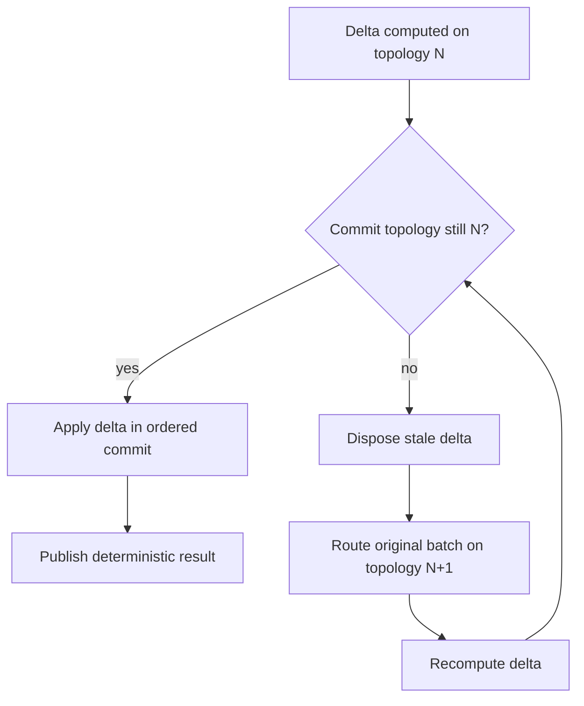

# Розділ 17: Свіжі карти на ходу (Stale Topology Recompute)

Паралельні обчислення дельт стають по-справжньому драматичними, коли на сцену виходить динамічний ребаланс шардів. У розподілених радарних мережах навантаження на обробники змінюється щомиті: грозовий фронт зміщується з однієї географічної зони в іншу, перевантажуючи одні обчислювальні шарди та залишаючи без діла інші.

Щоб оптимізувати роботу, RadarPulse використовує динамічну топологію розподілу джерел. Але коли ви намагаєтеся одночасно міняти карту доріг і запускати по ній швидкісні боліди-воркери, ви обов'язково отримаєте аварію. Якщо, звісно, у вас немає спеціального архітектурного детектора застарілих карт — **Stale Topology Recompute** (впровадженого під час віхи `022`).

---

## 17.1. Проблема застарілих навігаторів

Уявіть ситуацію з життя детективів. Слідча група виїздить на оперативне завдання за адресою, вказаною в орієнтуванні. Вони використовують офіційну карту міста версії 10 (наша версія топології — `TopologyVersion = 10`). Шлях прокладено, екіпаж вирушив.

Але поки вони їхали, інший відділ поліції успішно завершив попередню справу, зафіксував зміни у міській інфраструктурі й перекрив кілька вулиць, зробивши їх односторонніми. Карта міста офіційно оновилася до версії 11.

Коли наш перший екіпаж прибуває на місце події та намагається здійснити затримання (зробити комміт результатів у базу), виявляється, що вони заїхали під «цеглу» і порушили правила дорожнього руху. Їхні дії нелегітимні, оскільки вони орієнтувалися на застарілу версію карти.

У світі RadarPulse це виглядає так:

1. Воркер №3 бере радарний батч №3 і прокладає маршрут розподілу подій (`Route`) на основі поточної топології версії N. Він запускає розрахунок дельти на фоновому потоці.
2. У цей же час Воркер №2 завершує роботу над батчем №2 трохи раніше. Оскільки цей батч містив серйозні навантаження, його комміт у ядро запускає тригер ребалансу. Система перерозподіляє шарди й офіційно переводить топологію ядра на версію N+1.
3. Коли Воркер №3 нарешті приносить свою дельту до Координатора для комміту, той звіряє версії: дельта була порахована для топології N, а поточний стан ядра вимагає топологію N+1.

Якщо просто записати цю дельту в ядро, ми отримаємо корупцію розподілу даних: події радарних джерел будуть записані в застарілі шарди, порушаться індекси адресації, а система втратить математичну узгодженість. Це злочин, який ми не можемо допустити.

---

## 17.2. Запобіжник Stale Topology Recompute

Для вирішення цієї проблеми під час віхи `022` ми впровадили механізм виявлення та перерахунку застарілих дельт. Замість того, щоб блокувати систему або записувати некоректні дані, ми діємо рішуче:

* **Детекція розбіжностей:** Під час спроби здійснення комміту Координатор порівнює `Route.TopologyVersion` дельти з поточною версією топології сесії. Якщо версії збігаються — дельта записується миттєво. Якщо ні — оголошується тривога.
* **Знищення застарілого доказу:** Застаріла дельта безжально викидається. Викликається метод `Dispose`, який повертає орендовані масиви в `ArrayPool`, щоб не допустити витоку пам'яті.
* **Повторний забіг (Recompute):** Оскільки система дбайливо зберігає оригінальний радарний батч у буфері черги, вона негайно створює новий маршрут обробки (`Route`) на базі вже нової, актуальної топології N+1. Батч повторно відправляється на обробку воркерам.
* **Чистий комміт:** Після того, як воркери перерахували батч за новими правилами, свіжа дельта успішно проходить валідацію топології та фіксується в ядрі.

У коді це не виглядає як драматична сцена з мапами. Це короткий, жорсткий decision loop:



Даний підхід зберігає топологічні інваріанти системи в момент комміту: результат застосовується лише тоді, коли його карта світу збігається з реальною картою ядра.

---

## 17.3. Ціна точності: Метрики та перформанс

Звісно, за все в цьому житті доводиться платити. Повторна обробка радарних батчів через застарілі карти топології — це додаткове навантаження на процесор та пам'ять.

Під час проведення стрес-тестів під час віхи `022` за допомогою спеціального інструменту порівняльного аналізу `rebalance-synthetic --mode ordered-rebalance` ми зафіксували точні цифри цього впливу.

Workload тесту виглядав так:
* Кількість ітерацій: **2 000**
* Батчів на ітерацію: **16**
* Загальна кількість логічних батчів: **32 000**
* Кількість успішних змін топології (accepted moves): **2 000**

Коли ми порівняли паралельну обробку з лімітом у 4 активні батчі (`ActiveBatches = 4`) проти послідовного базового сценарію (`ActiveBatches = 1`), детективні метрики показали наступне:

1. **Зростання кількості запусків воркерів:**
   Для обробки 32 000 логічних батчів система фактично здійснила **39 292** запуски воркерів! Це означає, що **7 292** батчі були обчислені повторно через те, що їхня топологія встигла застаріти, поки вони перебували в польоті на фонових потоках.
2. **Накладні витрати на виділення пам'яті (Allocations):**
   Коефіцієнт виділення пам'яті зріс до **1.137x** порівняно з послідовним виконанням. Це прямий наслідок повторних рендерингів та перерахунків дельт.
3. **Загальний виграш у часі (Elapsed Time):**
   Незважаючи на тисячі повторних обчислень, загальний час виконання всього тесту склав **0.891x** від послідовного часу обробки! Тобто, ми отримали чисте **прискорення обробки на ~11%**.

Чому паралелізм переміг навіть із урахуванням повторної роботи? Тому що процесорні ядра ефективно утилізували вільні ресурси, а вартість перерахунку дельт на локальних потоках виявилася значно нижчою, ніж постійне послідовне очікування завершення кожного кроку.

## 17.4. Кеш-оптимізація гарячого перерахунку (Hot Recompute path)

Важливим фактором, який утримав накладні витрати на повторний обчислювальний шлях у межах 11%, є локальність даних у пам'яті.

Коли батч відправляється на повторний розрахунок, його вихідні бінарні дані та структури `RadarStreamEvent` вже лежать у швидкісній оперативній пам'яті (RAM) та гарячому кеші L3 процесора AMD Ryzen 9 після щойно проведеного першого прогону. Нам не потрібно знову звертатися до повільного SSD чи робити повторну декомпресію BZip2. Процесор Zen 5 виконує повторний розрахунок дельти практично повністю всередині своєї надшвидкої внутрішньої пам'яті, що зводить вартість переобчислення до мінімуму.

Головний висновок цього розслідування: механізм **Stale Topology Recompute** є життєздатним і виміряним. Він дозволяє поєднувати гнучкість динамічного ребалансу з паралельним обробником, не підміняючи correctness оптимістичною вірою в те, що стара топологія “майже така сама”.
---

## 🔍 Матеріали справи (Investigation Case Files)

### 1. Вердикт детективів (Decision Trace & Rationale)
Впровадження стратегії `Stale Topology Recompute` (Віха `022`). Якщо під час асинхронного розрахунку батча відбулася зміна топології (ребалансування шардів), обчислена дельта вважається застарілою. Система автоматично відкидає її та перераховує на льоту перед фінальним коммітом.

#### Чому застарілий маршрут треба рахувати заново
Коли topology змінюється під час обчислення, можна було заблокувати всі міграції до завершення активних батчів. Це безпечно, але робить rebalance повільним під реальним тиском. Можна було приймати стару дельту й сподіватися, що різниця несуттєва, але це вже не інженерія, а азарт. Ми обрали stale detection і recompute: якщо карта змінилася, старий розрахунок не коммітиться. Ціна вибору — додаткові worker runs і виміряна allocation-ціна; виграш — correctness сильніший за поспіх.

### 2. Закони фізики рантайму (System Invariants)
* **Збіг версії топології**: `TopologyVersion` дельти на момент комміту має строго дорівнювати поточній версії ядра.
* **Ціна перерахунку**: Збільшення кількості запусків воркерів з 32,000 до 39,292 та зростання алокацій на 1.137x під час активної зміни топології.

### 3. Патологоанатомічний звіт (Failure Modes & Recovery)
* **Атака застарілих даних**: Якщо топологія оновлюється занадто швидко, система відкидає застарілі дельти і запускає їх перерахунок, стабілізуючи стан ядра перед коммітом.

### 4. Докази продуктивності (Performance Evidence)

| Твердження (Claim) | Доказ (Evidence) | Де дивитися |
| :--- | :--- | :--- |
| Active-batch overlap дав виграш навіть під topology churn | Processing-bottleneck matrix: `active=4 elapsed ratio 0.891x` проти same-path `active=1`, accepted moves `2_000 vs 2_000`, failed migrations `0` | [022-ordered-rebalance-topology-commit-processing-bottleneck-performance-matrix.md](../../milestones/022-ordered-rebalance-topology-commit-processing-bottleneck-performance-matrix.md) |
| Recompute був реальною роботою, а не декоративним прапорцем | Matrix і closeout фіксують `39_292` worker dispatches для `32_000` logical batches та allocation ratio `1.137x` | [022-ordered-rebalance-topology-commit-closeout.md](../../milestones/022-ordered-rebalance-topology-commit-closeout.md) |
| Unit-тести охороняють replay/recovery contract | `TopologyReplay` suite перевіряє відновлення та порядок застосування topology state | `dotnet test tests/RadarPulse.Tests --filter "FullyQualifiedName~TopologyReplay"` |

### 5. Слід доказової бази (Implementation & Tests)
* Перерахунок топології: [RadarProcessingDurableRebalanceSession.Recovery.cs](../../../src/Infrastructure/Processing/Durable/Services/RadarProcessingDurableRebalanceSession/RadarProcessingDurableRebalanceSession.Recovery.cs)
* Інтеграційні тести топології: [RadarProcessingDurableRebalanceSessionTests.TopologyReplay.cs](../../../tests/RadarPulse.Tests/Processing/Rebalance/RadarProcessingDurableRebalanceSessionTests/RadarProcessingDurableRebalanceSessionTests.TopologyReplay.cs)
* Decision trace і closeout: [022-ordered-rebalance-topology-commit-decision-trace.md](../../milestones/022-ordered-rebalance-topology-commit-decision-trace.md), [022-ordered-rebalance-topology-commit-closeout.md](../../milestones/022-ordered-rebalance-topology-commit-closeout.md)

### 6. Протокол допиту процесу (Verification Commands)
Запуск тестування відновлення та перерахунку топологій:
```bash
dotnet test tests/RadarPulse.Tests/RadarPulse.Tests.csproj --filter "FullyQualifiedName~TopologyReplay"
```
