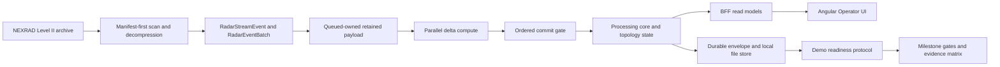

# виконавчий інженерний вердикт (Executive Engineering Verdict): чому RadarPulse вартий уваги

Ця книга написана не для того, щоб просити довіри. Вона зібрана як інженерна справа: є початковий масштаб, є помилки, є альтернативи, є ціна вибору, є гейти продуктивності (performance gates), є команди відтворення і є чітко названі межі відповідальності. Важлива обіцянка тексту проста: якщо твердження звучить сильно, поруч має бути або код, або віха (milestone), або межа, за яку ми не заходимо.

Якщо читач має лише пів години, йому не потрібно проходити всі 26 розділів як роман. Для цього є короткий маршрут рецензента (reviewer route) у [Додатку Г](appendix_d_reviewer_attack_pack.md): він веде від сильних тверджень (claims) до коду, тестів, доказів із віх (milestone evidence) і меж відповідальності без занурення в довгі runbook-и. Після цього можна відкривати підняття платформи (platform bootstrap) у [Додатку Е](appendix_f_lab_stand_bootstrap.md) або [Додатку Є](appendix_g_lab_stand_linux.md) лише тоді, коли рецензент справді готовий відтворювати стенд.

## Маршрут читача

| Якщо у вас є | Читайте так | Рішення, яке можна прийняти |
| :--- | :--- | :--- |
| 15 хвилин | Цей verdict, системну мапу нижче і [Додаток Б](appendix_b_claim_evidence_matrix.md) | Чи є в claims реальні докази |
| 30 хвилин | Цей вердикт (verdict), [Додаток Б](appendix_b_claim_evidence_matrix.md) і 30-хвилинний маршрут (30-minute route) у [Додатку Г](appendix_d_reviewer_attack_pack.md) | Чи варто переводити захист роботи з базової перевірки тверджень (claims) у розмову про продукційні компроміси (production trade-offs) |
| 45 хвилин | Розділи [3](chapter_03_radar_batch.md), [11](chapter_11_allocation_anomaly.md), [12](chapter_12_pooled_copy.md), [16](chapter_16_mutable_core.md), [17](chapter_17_stale_recompute.md), [26](chapter_26_observability_logging.md), [Додаток Г](appendix_d_reviewer_attack_pack.md), [Додаток Д](appendix_e_simulated_hostile_reviewer_transcript.md) | Чи автор витримує технічну рецензію рівня principal (principal-level technical review) |
| 2 години | Усі глави плюс [Додаток А](appendix_a_profiling.md), [Додаток Б](appendix_b_claim_evidence_matrix.md), [Додаток В](appendix_c_production_hardening.md), [Додаток Е](appendix_f_lab_stand_bootstrap.md) або [Додаток Є](appendix_g_lab_stand_linux.md) | Які продукційні прогалини (production gaps) лишаються і чи стенд можна повторити без автора на обраній платформі |

## Система на одній сторінці

Це головний контур книги. Архів дає реальні бінарні дані, streaming contract робить їх придатними для hot path, retained payload контролює lifetime, parallel compute шукає швидкість, ordered commit повертає порядок, durable layer фіксує recovery story, а BFF/UI/demo package показують результат без прихованих production-claims.

## Що тут доведено

| Зона компетенції | Що показує книга | Де перевірити |
| :--- | :--- | :--- |
| Орієнтований на дані дизайн (Data-oriented design) | Автор не віддає домену сирий NEXRAD binary stream, а проектує компактний `RadarStreamEvent` і `RadarEventBatch` із контрольованим payload lifetime | [Розділ 3](chapter_03_radar_batch.md), [Додаток А](appendix_a_profiling.md) |
| Дисципліна пам'яті рантайму (Runtime memory discipline) | Allocation crisis не приховано і не списано на GC: `snapshot-copy` отримує діагноз, після чого `pooled-copy` знижує retained allocation з `9_947_507_832` до `102_811_264` bytes | [Розділ 11](chapter_11_allocation_anomaly.md), [Розділ 12](chapter_12_pooled_copy.md) |
| Цілісність вимірювань (Measurement integrity) | Unit-тести відділені від benchmark-доказів; цифри продуктивності ведуть до milestone gate/closeout, а не до красивої фрази в тексті | [Додаток Б](appendix_b_claim_evidence_matrix.md) |
| Коректність конкурентності (Concurrency correctness) | Автор не просто додає воркери, а зупиняється на блокері Slice 3 (Slice 3 blocker), розділяє compute/commit і приймає виміряну ціну безпеки (safety tax) | [Розділ 16](chapter_16_mutable_core.md), [Розділ 17](chapter_17_stale_recompute.md) |
| Обробка відмов (Failure handling) | Durable envelope, file store і поведінка fail-closed (зупинка без прихованої неправди) описані як автомати станів та протокол відновлення (recovery protocol), а не як “надійність за замовчуванням” | [Розділ 18](chapter_18_durable_envelope.md), [Розділ 19](chapter_19_file_store.md), [Розділ 20](chapter_20_fail_closed.md) |
| Межа продукту (Product boundary) | BFF, operator UI і demo package не маскують локальну природу стенда; non-claims винесені в явний контракт із рецензентом | [Розділ 23](chapter_23_bff_shield.md), [Розділ 25](chapter_25_demo_scripts.md) |
| Дисципліна спостережуваності (Observability discipline) | Книга не вигадує продукційний стек логування (production logging stack), але показує типізований контракт діагностики й готовності (typed diagnostics/readiness contract): перший блокер (first blocker), retained pressure, durable state, warnings і capacity evidence | [Розділ 26](chapter_26_observability_logging.md), [Додаток В](appendix_c_production_hardening.md) |

## Рішення, яке має прийняти експерт

Після цієї книги базове питання “чи розуміє автор GC, concurrency, clean architecture, benchmarking і failure modes” стає слабкою формою захисту. Ці теми вже мають артефакти. Значно продуктивніше говорити про продукційні компроміси (production trade-offs): який SLA потрібен, де закінчується одновузловий лабораторний стенд (single-node lab table), коли треба вводити зовнішній брокер, яку частину BFF варто винести за reverse proxy, які бюджети ризику (risk budgets) приймає команда. Для цього в книзі є окремий [план підготовки до продукційної експлуатації (Production Hardening Plan)](appendix_c_production_hardening.md), який не розширює поточні claims, а показує порядок дорослого перенесення інваріантів у production.

Інакше кажучи, ця книга не доводить, що RadarPulse вже є хмарною production-платформою. Вона доводить інше: автор уміє знаходити приховану ціну архітектурних рішень, вимірювати її, не ховати неприємні результати й перетворювати кризу на керований контракт.

Як прикладна інженерна робота для senior/principal-level захисту це сильніший формат, ніж набір правильних відповідей на базові технічні питання. Сильний читач після цієї книги має бачити не “автор знає правильні слова”, а “автор здатен тримати систему в голові, сперечатися з власними рішеннями, знаходити ризики до того, як їх знайде production, і залишати після себе відтворювані докази”.

## Де варто тиснути на автора

Сильна книга не боїться місць для атаки. Повний набір таких атак винесено в [Додаток Г](appendix_d_reviewer_attack_pack.md), а детальна simulated-сесія з follow-up і verdict — у [Додаток Д](appendix_e_simulated_hostile_reviewer_transcript.md). Найкращі питання до автора після прочитання:

1. Де саме локальний `FileDurableEnvelopeStore` перестає бути достатнім і який broker/database adapter ви ввели б першим?
2. Який traffic benchmark потрібен для BFF, щоб перетворити downsampling/compression intent на performance claim?
3. Як би ви довели handler delta/merge contract для сторонніх обробників, які мають складний власний стан?
4. Чи може сторонній reviewer відтворити `data/nexrad` cache і пройти archive/product verification без приватних інструкцій автора?
5. Який мінімальний structured logging/metrics/tracing contract потрібен, щоб production incident не перетворився на ручну археологію?
6. Який мінімальний пакет production hardening (підготовки до продукційної експлуатації) потрібен для багатовузлового розгортання (multi-node deployment), не руйнуючи lab-table повторюваність?
7. Які з поточних benchmark-гейтів (гейтів бенчмарків) мають стати блокувальними для CI (CI-blocking), а які мають лишитися ручними релізними гейтами (release gates) через шум заліза?

Якщо розмова починається з цих питань, книга виконала свою роботу.
